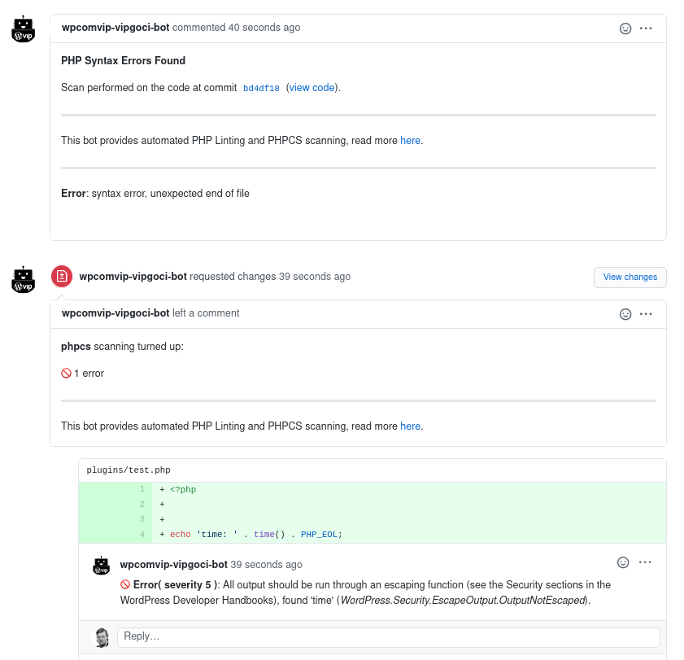
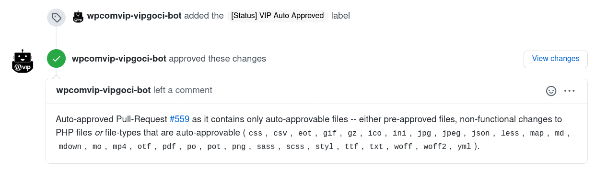
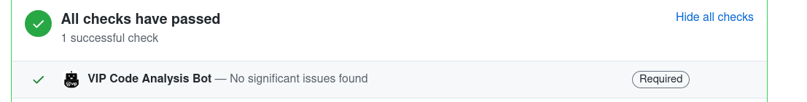

# vip-go-ci

Continuous integration for VIP Go repositories.

`vip-go-ci` is a PHP command-line program intended to scan commits pushed to pull requests on GitHub. It will call external scanners to perform the actual scans, then collects the issues found, and posts them as comments and reviews to the GitHub pull requests associated with the commits. The aim of `vip-go-ci` is to display issues found in code by scanners in a uniform way, and to automate the analysis of code. It tries to avoid repeating reporting of issues found in earlier scans.

Currently, a number of types of scanners are supported:

* PHP linting. Uses built in PHP linter (`php -l`). Intended to find syntax errors.
* [PHPCS](https://github.com/squizlabs/PHP_CodeSniffer/). Intended to find operational issues, etc.
* [SVG scanner](https://github.com/Automattic/vip-go-svg-sanitizer). Intended to find suspicious elements, attributes or external references.

Here is an example of the scanning results provided by `vip-go-ci`:



`vip-go-ci` scans files differently depending on file type:

* For PHP linting, it will loop through every file existing in the code-base, and post a generic pull request comment for any issues it finds with the PHP-code. 
* With PHPCS scanning it will scan only the files affected by the pull request using PHPCS and post a GitHub review on the pull request.
* SVG scanning behaves similar to PHPCS scanning. 

In addition to the above scanning, `vip-go-ci` can also automatically approve pull requests that fulfill a certain criteria:

* Only non-functional changes are made in PHP code submitted (e.g., white-space changes only, comments added, etc).
* The submitted PHP or JavaScript code is registered in database of previously reviewed, safe code.
* With SVG scanning enabled, SVG files are approved if the scanner finds no issues in the scanned files.
* Only CSS, images and other objects are altered and no PHP or JavaScript code. This is based on file-endings, and is configurable. For example, `.txt, .css, .gif, .jpg, .jpeg, .png`.
* Any combination of the above that covers all the changes in the pull request submitted is automatically approved.

Here is an example auto approval by `vip-go-ci`:



`vip-go-ci` will not re-approve a pull request already approved by itself, but it will remove previous approval by itself if the pull request does not fulfil the requirements for approval any longer.

`vip-go-ci` requires a number of parameters to be specified on the command-line to operate; this includes the repository, commit-ID to scan, paths to scanners, what types of scan to perform as well as other parameters.  The program expects a fully-functional git-repository to be stored locally on the computer running it (i.e., all branches are available), where from it can extract various information. During execution, `vip-go-ci` will provide a detailed log of its actions and what it encounters. 

`vip-go-ci` supports scanning the same commit multiple times. When new commits are added to a pull request, the latest commit can be scanned, and no manual action has to be taken with earlier feedback generated by it.

`vip-go-ci` has support for a number of other features in addition to the above, such as:
* Publishing a <a href="#setting-github-build-status">GitHub build status</a>.
* Automatic submission of <a href="#general-support-messages">support messages to pull requests</a>.
* Auto approval of files via <a href="#hashes-api">Hashes API</a>.
* Dismissing <a href="#dismissing-stale-reviews">stale reviews</a>.
* Logging messages to a <a href="#irc-support">IRC gateway</a>.

Most features are configurable via parameters.

## Setting up

### System requirements

* `vip-go-ci` requires PHP 7.3 or later. PHP 7.4 is preferred.
* Linux is recommended as a platform for `vip-go-ci`.
* git version 2.10 or later.
* Working bash shell.
* Access to GitHub API and other APIs configured.

### Installing

`vip-go-ci` comes with a small utility, `tools-init.sh`, that will install PHPCS and related tools in your home-directory upon execution. This utility will check if the tools required are installed, and if not, install them, or if they are, check if they are of the latest version, and upgrade them as needed. It is highly recommended to run this utility on a regular basis.

### Running on the console, standalone

`vip-go-ci` can be run standalone on the console. This is mainly useful for debugging purposes and to understand if everything is correctly configured, but for production purposes it should ideally be run via some kind of build management software (for instance TeamCity or GitHub Actions). To run `vip-go-ci` on the console, a few tools are required. The `tools-init.sh` script that is included will install the tools needed.

First install the utilities using `tools-init.sh`. Then clone the repository that should be scanned, check out the branch that should be scanned and ensure it is up to date.

Then run  `vip-go-ci.php`:

> ./vip-go-ci.php --repo-owner=`repo-owner` --repo-name=`repo-name` --commit=`commit-ID` --token=`GitHub-Access-Token` --local-git-repo=`Local-Git-Repo` --phpcs-path=`phpcs-path` --phpcs=true --lint=true --autoapprove=true --autoapprove-filetypes=`File-Types` --autoapprove-label=`[Status] Auto Approved` --informational-msg=`Informational-Msg

-- where `repo-owner` is the GitHub repository-owner, `repo-name` is the name of the repository, `commit-ID` is the SHA-hash identifying the commit, `Local-Git-Repo` is a path to the git-repository used to scan, `GitHub-Access-Token` is a access-token created on GitHub that allows reading and commenting on the repository in question, `path-to-phpcs` is a full path to PHPCS, `File-Types` refers to a list of file-types to be approved (such as `css,txt,pdf`), and `Informational-Msg` is a message that explains the CI process.

While running, `vip-go-ci` will output log of its actions. Here is an example -- note that output generated on your system can differ substantially:

```
[ 2018-04-16T14:10:04+00:00 -- 0 ]  Initializing...; []
[ 2018-04-16T14:10:04+00:00 -- 0 ]  Trying to get information about the user the GitHub-token belongs to; []
[ 2018-04-16T14:10:05+00:00 -- 0 ]  Starting up...; {
    "options": {
        "repo-owner": "mygithubuser",
        "repo-name": "testing123",
        "commit": "f978c17f8f648e5ce10aa16694c74a5544b1670e",
        "local-git-repo": "\/tmp\/git-testing123",
        "phpcs": true,
        "lint": true,
        "phpcs-path": "\/home\/myuser\/vip-go-ci-tools\/phpcs\/bin\/phpcs",
        "phpcs-standard": "WordPress-VIP-Go",
        "phpcs-severity": 5,
        "branches-ignore": [],
        "autoapprove": true,
        "autoapprove-filetypes": [ "css", "txt", "pdf ],
        "php-path": "php",
        "debug-level": 0,
        "dry-run": false
    }
}
[ 2018-04-16T14:10:05+00:00 -- 0 ]  Fetching all open Pull-Requests from GitHub; {
    "repo_owner": "mygithubuser",
    "repo_name": "testing123",
    "commit_id": "f978c17f8f648e5ce10aa16694c74a5544b1670e",
    "branches_ignore": []
}
[ 2018-04-16T14:10:14+00:00 -- 0 ]  Fetching information about all commits made to Pull-Request #17 from GitHub; {
    "repo_owner": "mygithubuser",
    "repo_name": "testing123",
    "pr_number": 17
}
[ 2018-04-16T14:10:48+00:00 -- 0 ]  About to clean up generic PR comments on Github; {
    "repo_owner": "mygithubuser",
    "repo_name": "testing123",
    "commit_id": "f978c17f8f648e5ce10aa16694c74a5544b1670e",
    "branches_ignore": [],
    "dry_run": false
}
[ 2018-04-16T14:10:48+00:00 -- 0 ]  About to lint PHP-files; {
    "repo_owner": "mygithubuser",
    "repo_name": "testing123",
    "commit_id": "f978c17f8f648e5ce10aa16694c74a5544b1670e"
}
[ 2018-04-16T14:10:50+00:00 -- 0 ]  About to PHP-lint file; {
    "repo_owner": "mygithubuser",
    "repo_name": "testing123",
    "commit_id": "f978c17f8f648e5ce10aa16694c74a5544b1670e",
    "filename": "bla-1.php",
    "temp_file_name": "\/tmp\/lint-scan-jniXTN"
}
[ 2018-04-16T14:10:50+00:00 -- 0 ]  Fetching file-contents from local Git repository; {
    "repo_owner": "mygithubuser",
    "repo_name": "testing123",
    "commit_id": "f978c17f8f648e5ce10aa16694c74a5544b1670e",
    "filename": "bla-2.php",
    "local_git_repo": "\/tmp\/git-testing123"
}
[ 2018-04-16T14:10:51+00:00 -- 0 ]  About to PHPCS-scan all files affected by any of the Pull-Requests; {
    "repo_owner": "mygithubuser",
    "repo_name": "testing123",
    "commit_id": "f978c17f8f648e5ce10aa16694c74a5544b1670e"
}
[ 2018-04-16T14:10:51+00:00 -- 0 ]  Fetching file-contents from local Git repository; {
    "repo_owner": "mygithubuser",
    "repo_name": "testing123",
    "commit_id": "f978c17f8f648e5ce10aa16694c74a5544b1670e",
    "filename": "bla-2.php",
    "local_git_repo": "\/tmp\/git-testing123"
}
[ 2018-04-16T14:10:51+00:00 -- 0 ]  About to PHPCS-scan file; {
    "repo_owner": "mygithubuser",
    "repo_name": "testing123",
    "commit_id": "f978c17f8f648e5ce10aa16694c74a5544b1670e",
    "filename": "bla-2.php",
    "temp_file_name": "\/tmp\/phpcs-scan-U3DbUE.php"
}
[ 2018-04-16T14:10:52+00:00 -- 0 ]  About to submit generic PR comment to GitHub about issues; {
    "repo_owner": "mygithubuser",
    "repo_name": "testing123",
    "commit_id": "f978c17f8f648e5ce10aa16694c74a5544b1670e",
    "results": {
        "issues": {
            "12": []
        },
        "stats": {
            ...
        }
    },
    "dry_run": false
}
[ 2018-04-16T14:10:52+00:00 -- 0 ]  About to submit comment(s) to GitHub about issue(s); {
    "repo_owner": "mygithubuser",
    "repo_name": "testing123",
    "commit_id": "f978c17f8f648e5ce10aa16694c74a5544b1670e",
    "results": {
        "issues": {
            "12": []
        },
        "stats": {
		...
        }
    },
    "dry_run": false
}
[ 2018-04-16T14:10:52+00:00 -- 0 ]  Shutting down; {
    "run_time_seconds": 48,
    "run_time_measurements": {
        "git_cli": 0.0699622631073,
        "github_forced_wait": 11.001686811447,
        "github_api": 30.39110994339,
        "lint_scan_commit": 1.7449381351471,
        "git_repo_scandir": 9.8228454589844e-5,
        "lint_scan_single_file": 0.22931528091431,
        "git_repo_fetch_file": 0.00043511390686035,
        "save_temp_file": 0.00095939636230469,
        "php_lint_cli": 0.20436358451843,
        "phpcs_scan_commit": 2.2697520256042,
        "phpcs_scan_single_file": 0.33324813842773,
        "phpcs_cli": 0.32072472572327,
        "git_repo_blame_for_file": 0.020441055297852
    },
    "results": {
        "issues": {
            "12": []
        },
        "stats": {
            ...
	}
    }
}
```

### Running using TeamCity runner

You can set up `vip-go-ci` with TeamCity, so that when a commit gets pushed to GitHub, `vip-go-ci` will run and scan the commit automatically. Any other similar build management software can be used. 

This flowchart shows how `vip-go-ci` interacts with TeamCity, git, GitHub, and the utilities it uses:


To get `vip-go-ci` working, follow these steps:

* Create a project, and link it to the GitHub repository you wish to scan
* Create a build-runner by clicking on `Create build configuration` on the project
* Define a build-feature, by clicking on `Add Build Feature` (located in `Build Features`, found in the project-settings). Define the type of the build-feature as `Commit status publisher`, `VCS Root` as `All attached VCS Roots`, and `Publisher` as `GitHub`.
* Click on `Version Control Settings` (in the project-settings), make sure to do the following:
  - Checkout directory as `Custom path`, and path as something unique and unreadable from other users (local-directory for the build-runner user would be optimal).
  - Click on `Clean all files in the checkout directory before the build`.
* Define parameters for the build. In the project-settings, click on`Parameters`, then click 'Add Parameter' and follow the on-screen instructions. The parameters that need to be added are `REPO_ORG`, `REPO_NAME`, and `REPO_TOKEN` and with values appropriate with for the repository which is to be scanned.

* Make sure the build-runner is of the `Command Line` type, that `If all previous steps finished successfully` is chosen, and that `Custom Script` is chosen for the run `Run` field.
* Add a shell-script into the `Custom Script` field, the script should look something like the following:

```
#
# If vip-go-ci-tools does not exist, get it in place.
# by fetching and running tools-init. If it does exist,
# run tools-init.sh anyway to check for updates.
#

if [ -d ~/vip-go-ci-tools ] ; then
	bash ~/vip-go-ci-tools/vip-go-ci/tools-init.sh
else
	wget https://raw.githubusercontent.com/Automattic/vip-go-ci/main/tools-init.sh -O tools-init.sh && \
	bash tools-init.sh && \
	rm -f tools-init.sh
fi


#
# Make sure to disable PHPCS-scanning by default
#

PHPCS_ENABLED=${PHPCS_ENABLED:-false}

#
# Actually run vip-go-ci
#

php ~/vip-go-ci-tools/vip-go-ci/vip-go-ci.php --repo-owner="$REPO_ORG" --repo-name="$REPO_NAME" --commit="$BUILD_VCS_NUMBER"  --token="$REPO_TOKEN" --local-git-repo="%system.teamcity.build.checkoutDir%" --phpcs="$PHPCS_ENABLED" --lint="$LINTING_ENABLED"  --phpcs-path="$HOME/vip-go-ci-tools/phpcs/bin/phpcs"
```

Note that the above script calls `tools-init.sh` to automatically update the utilities needed. See <a href="#installing">installing</a> for details. Also possible, but not shown in the example, is <a href="#setting-github-build-status">setting GitHub build status</a>.


The parameters above should be self-explanatory. Note that --commit should be left exactly as shown above, as `$BUILD_VCS_NUMBER` is populated by TeamCity. Other variables, `$REPO_ORG`, `$REPO_NAME` and `$REPO_TOKEN` are populated by TeamCity on run-time according to your settings (see above).

That is it. Now TeamCity should run `vip-go-ci.php` for every incoming commit to any pull request associated with the repository.


### Starting a local instance of TeamCity

You can start a local instance of TeamCity in Docker if you like.

```
docker-compose up -d
open http://localhost:8111
```

To start with multiple agents (for example, three):

```
docker-compose up -d --scale agent=3
```

Alternatively, if you do not wish to run TeamCity in a Docker-instance, you can download it and set it up manually.


###  Exit codes

`vip-go-ci.php` exits with different UNIX exit codes depending on what problems were found and if any system issues were encountered:

* Code `0`: Normal, no errors were found in the code scanned and no fatal system errors were encountered. There could have been warnings found in the code, though.
* Code `230`: Commit specified is not associated with any pull request.
* Code `249`: Scanning exceeded maximum time allowed.
* Code `250`: Scanning was completed, but some errors were found in the code.
* Code `251`: Exiting due to a system problem.
* Code `252`: A fatal problem with GitHub was encountered leading to an exit.
* Code `253`: A problem with usage options was detected, leading to an exit.

## Other features

`vip-go-ci` has support for various features not documented above, such as dismissing stale reviews, setting specific options via the repository being scanned and more. These features are configurable via the command-line or the environment, and are documented below.

Note: To make it easier to read the documentation below, some required parameters are not shown (such as `--repo-owner`, `--repo-name`, etc).

### Configuring via environmental variables

If you run `vip-go-ci` in an environment such as `TeamCity` or `GitHub Actions`, it can be useful to configure certain parameters via environmental variables. This way, the parameters are not visible in any logs and cannot be seen in the process-tree during run-time. With `vip-go-ci`, this can easily be done by running it this way:

> ./vip-go-ci.php --commit="$COMMIT_ID" --phpcs=true --lint=true --autoapprove=true --autoapprove-filetypes="css,txt,pdf" --env-options="repo-owner=GH_REPO_OWNER,repo-name=GH_REPO_NAME,token=GH_TOKEN"

In this case, `--repo-owner` will be read from the `$GH_REPO_OWNER` environmental variable, `--repo-name` from `$GH_REPO_NAME`, and so forth. Other parameters are set via the command-line.

Any parameter can be read from the environment, not just those shown. Parameters read from environmental variables are processed and sanitized exactly the same way as parameters directly specified on the command-line. You can configure some parameters from the command-line directly, while others are read from the environment. Parameters configured via the command-line cannot be configured also from the environment; in such situations, the latter ones will be ignored on run-time.

### Configuration via repository config-file

A number of options can currently be configured via a repository config-file. This way, users with commit-access to a git repository can influence the behaviour of `vip-go-ci` when it scans the repository. The idea is to allow users flexibility in how scanning is performed. Various sanity checks are made to the configuration options read. Some options that can be specified via repository options are outlined below, while others are documented along with the feature itself below (see for example section on PHPCS). A default configuration option is overwritten during run-time by the new value, should it be valid. `vip-go-ci` can be configured to allow only certain options to be configured via config-file. 

The feature can be enabled or disabled via `--repo-options`; by default it is disabled. To use the feature, make sure a `.vipgoci_options` file can be found at the root of the relevant git-repository, containing something similar to this:

```
{"phpcs-severity":5,"skip-draft-prs":true}
```

Then run `vip-go-ci` like this:

> ./vip-go-ci.php --repo-options=true --repo-options-allowed="phpcs-severity,skip-draft-prs"

`--repo-options-allowed` specifies which options can be specified via `.vipgoci_options`, and that can be used to limit which options are allowed.

Should the configuration file not be found, any configuration value not be valid, or altering of the particular option is not allowed, the relevant option will not be altered on run-time. Note that not all options need to be set in the configuration file, only those desired. The file is expected to be a parsable, valid JSON.

You can use any combination of options you wish.


#### Option `--skip-execution`

This will make execution of `vip-go-ci` stop after initial startup, avoiding all further processing and scanning.

For example:

> {"skip-execution":true}

#### Option `--skip-draft-prs`

This will let `vip-go-ci` skip scanning of any pull requests that are marked as `draft` on GitHub. This applies to all types of scanning, PHPCS, linting, etc.

For example:

> {"skip-draft-prs":true}

### Maximum execution time

`vip-go-ci` supports setting maximum execution time. Once the maximum time is exceeded, it will exit with an error code (see [above](#exit-codes)).

Use the `--max-exec-time` option to set maximum execution time (in seconds):

> ./vip-go-ci.php ... --max-exec-time=600

### Informational message

To help users understand better why a bot is posting comments and reviews on their pull requests, and sometimes automatically approving them, it can be helpful to have a bit of information added to the comments `vip-go-ci` posts. This feature serves this purpose.

To have a message posted, simply run `vip-go-ci` with a `--informational-msg` parameter:

> ./vip-go-ci.php --informational-msg="This bot provides automated PHP Linting and PHPCS scanning, read more [here](https://github.com/automattic/vip-go-ci/)."

The message will be included in any generic pull request comments or pull request reviews submitted.

### PHPCS configuration

Support for checking for issues in PHP files by using [PHPCS](https://github.com/squizlabs/PHP_CodeSniffer/) scanning is supported. The behaviour of PHPCS scanning can be configured using several options.

An example of how PHPCS can be used:

> ./vip-go-ci.php --phpcs=true --phpcs-path="$HOME/vip-go-ci-tools/phpcs/bin/phpcs" --phpcs-standard="WordPress-VIP-Go,PHPCompatibilityWP" --phpcs-sniffs-exclude="WordPress.WP.PostsPerPage.posts_per_page_posts_per_page" --phpcs-sniffs-include="WordPress.DB.DirectDatabaseQuery" --phpcs-severity=1 --phpcs-runtime-set="testVersion 7.4-" --phpcs-skip-scanning-via-labels-allowed=true

With these settings, PHPCS is turned on, is expected to be found in the path shown above, should use two PHPCS standards (`WordPress-VIP-Go` and `PHPCompatibilityWP`), while excluding one particular PHPCS sniff and specifically include another one. When executing PHPCS, one runtime option should be set (`testVersion 7.4-`) and severity level should be `1`. Also, users can ask to skip scanning particular pull requests by setting a label named `skip-phpcs-scan`.

Any number of PHPCS standards can be specified, and any number of runtime settings as well. Also, see section above about configuring options via repository file.

Should any of the PHPCS sniffs included or excluded be invalid, this is reported in the relevant pull requests.

The following PHPCS-related options can be configured via repository config-file:

#### Options `--phpcs` and `--phpcs-severity`

Specifies if to do PHPCS scanning and specifies the severity level to pass to PHPCS when executed.

For example:

```
{"phpcs":true,"phpcs-severity":5}
```

#### Options `--phpcs-sniffs-exclude` and `--phpcs-sniffs-include`

These are array parameters and if specified in the options file, the items specified will be appended to the options specified on the command line. To configure the `phpcs-sniffs-exclude` option, one can specify something like this in the repository options file:

> {"phpcs-sniffs-exclude":["WordPressVIPMinimum.JS.InnerHTML", "WordPress.WP.CronInterval"]} 

The `phpcs-sniffs-include` is configured in the same way as the `phpcs-sniffs-exclude` option. Note that it works differently behind the scenes, as it will write out a new PHPCS standard on run-time, containing the sniffs to be included as well as the original PHPCS standard, and will then use this standard from then on. The `phpcs-sniffs-include` option is used in this way:

> {"phpcs-sniffs-include":["WordPress.DB.DirectDatabaseQuery"]} 

Please note that should any of the PHPCS sniffs specified be invalid, a warning will be posted on any pull request scanned. The warning will be removed during next scan and not posted again if the issue is fixed.

#### Options `--lint-modified-files-only`

The ``lint-modified-files-only`` option specifies whether the ``vip-go-ci`` bot should scan all the PHP files in the repository (including already merged files) or files modified by the PR only.

Due to performance concerns, the lint-modified-files-only option is enabled by default. It can be disabled through the ``.vipgoci_options`` configuration file. To disable the ``lint-modified-files-only`` option, ensure the ``.vipgoci_options`` configuration file is created in the git-repository and define the option as false. See the example below:

> {"lint-modified-files-only":false}

### SVG scanning

`vip-go-ci` supports scanning SVG files for dangerous tags. The scanning is accomplished by a [SVG scanner](https://github.com/Automattic/vip-go-svg-sanitizer), while `vip-go-ci` takes care of posting the issues found.

To make use of this feature, the `--svg-checks` and `--svg-scanner-path` options should be used. For example:

> ./vip-go-ci.php --svg-checks=true --svg-scanner-path="$HOME/vip-go-ci-tools/vip-go-svg-sanitizer/svg-scanner.php"

With these options, SVG scanning is turned on and a scanner at a particular path location is to be used. 

The following SVG-related options can be configured via repository config-file:

#### Option `--svg-checks`

Specifies if to do SVG scanning. For instance:

```
{"svg-checks": false}
```

### Autoapprovals

`vip-go-ci` can auto-approve pull requests that only alter particular types of files. The 'type' is based on file-ending, such as `.txt`. The idea is to allow faster approvals of pull requests that do not need to be reviewed or do not need any automated feedback.

For instance:

> ./vip-go-ci.php --autoapprove=true --autoapprove-filetypes="css,gif,ico,png,jpg" --autoapprove-label="auto-approved"

-- with this configuration, any pull requests that only alter files ending with `.css`, `.gif`, etc., are automatically approved by `vip-go-ci`. Also, a label will be added to the automatically approved pull requests, named `auto-approved`.

Auto-approvals can be configured so to auto-approve pull requests that only change comments or whitespacing in PHP files. For instance:

> ./vip-go-ci.php --autoapprove=true --autoapprove-php-nonfunctional-changes=true --autoapprove-label="auto-approved"

With this setting, any PHP files having only whitespacing changes or updating to comments, will be automatically approved.

Note also that if set up to auto-approve, and the Hases API feature (see below) is configured, it will be utilised.

If _all_ files altered by a pull request have been found to be auto-approvable -- for example, by the non-functional changes or Hashes API --, the whole pull request will be approved automatically.

The following Autoapprovals-related options can be configured via repository config-file:

#### Options `--autoapprove` and `--autoapprove-php-nonfunctional-changes`

Using these options, users can disable autoapproval entirely as well as the autoapprovals of non-functional changes.

For instance:

```
{"autoapprove": false, "autoapprove-php-nonfunctional-changes": false}
```

### Hashes API

This feature is useful when you want to automatically approve pull requests containing PHP or JavaScript files that are already known to be good and are approved already, so no manual reviewing is needed. To make use of this feature, you will need a database of files already approved. You will also have to be using the auto-approvals feature. 

The feature can be activated using the `--hashes-api` parameter and by specifying a HTTP API endpoint. For instance:

> ./vip-go-ci.php --autoapprove=true --hashes-api=true --hashes-api-url=https://myservice.mycompany.is/wp-json/viphash/

Configured this way, `vip-go-ci` will make HTTP API requests for any PHP or JavaScript file it sees being altered in pull requests it scans. The HTTP API requests would look like this:

> https://myservice.mycompany.is/wp-json/viphash/v1/hashes/id/[HASH]

where `[HASH]` is a SHA1 hash of a particular PHP or JavaScript file, after it all comments and whitespaces have been removed from them. `vip-go-ci` expects a JSON result like this from the HTTP API:

```
[{"status":"true"},{"status":"true"}]
```

The JSON result can contain other fields, but they are not used. Note that a single "false" status is enough to make sure a file is considered _not_ approved.

An open-source tool to label files as approved or non-approved is available [here](https://github.com/Automattic/vip-hash/). It requires a HTTP API service that `vip-go-ci` communicates with as well.

The following Hashes-API related option can be configured via repository config-file:

#### Option `--hashes-api`

Specifies if to check for approved files in Hashes-API. For instance:

```
{"hashes-api":true}
```

### Ignore certain branches

Sometimes users do not want specific branches scanned for any issues -- they want them effectively to be ignored. To do this, you can use the `--branches-ignore` option. 

For example:

> ./vip-go-ci.php --branches-ignore="foo,bar"

-- with this option in place, any pull requests targetting branches called `foo` or `bar` will be ignored and no feedback will be posted to them. 


### Skipping certain folders

If any specific folders should be ignored when linting or PHPCS scanning, one can use the `--lint-skip-folders` and/or `--phpcs-skip-folders` option parameters. Files in any folders specified in the options, relative to the git repository root, will be ignored when performing linting or PHPCS scanning.

For example:

> ./vip-go-ci.php --lint-skip-folders="foo,Tests/bar"

-- with this option in place, any files in the `foo/` or `Tests/bar` folders and subfolders will be exempt from PHP linting. The folders are relative to the git repository. Please note that regular expressions are not supported at this time.

Folders can also be specified in files placed at the root of the repository, `.vipgoci_lint_skip_folders` for PHP linting and `.vipgoci_phpcs_skip_folders` for PHPCS scanning. Each folder should be on a line of its own in the relevant file, and each path should be relative to the root of the repository.  This feature is activated using command-line options, for example:

> ./vip-go-ci.php --lint-skip-folders-in-repo-options-file=true --phpcs-skip-folders-in-repo-options-file=true

Any folders found in the files at the root of the repository will be merged with options specified on the command-line.

### Skipping large files

By default, `vip-go-ci` will skip scanning of any files that are longer than 15,000 lines and display a warning in GitHub reviews about the files skipped. This means that these files are not PHP linted, not PHPCS scanned nor SVG scanned. This feature was implemented because very large files will often cause scanning to take much longer time than is ideal, delaying submission of results, as well as causing GitHub API errors.

This feature can be disabled by setting the `--skip-large-files` parameter to `false`. The size limit can be changed from 15,000 to a custom value by setting the `--skip-large-files-limit` option.

### Configuring review comments 

Review comments posted can be configured and number of them limited.

#### Sorting review comments

One can sort the review comments posted according to severity of the issue found. This applies to any issue, PHPCS, SVG, etc. This is disabled by default.

The option can be used in this way:

> ./vip-go-ci.php --review-comments-sort=true

This option can be configured via repository-config file as well:

```
{"review-comments-sort":true}
```

#### Including severity in review comments

One can let `vip-go-ci` include the severity of the issue found in the review comments posted to GitHub. This is disabled by default.

The option can be used in this way:

> ./vip-go-ci.php --review-comments-include-severity=true

This option can be configured via repository-config file as well:

```
{"review-comments-include-severity":true}
```

#### Limiting review comments
One can limit the number of review comments posted to GitHub pull requests. Also, one can ignore certain comments so that they will not be posted to pull request reviews. This is useful when pull requests are created or updated, and contain many issues. 

The options can be used in this way:

> ./vip-go-ci.php --review-comments-max=15 --review-comments-total-max=70 --review-comments-ignore="Some error message"

-- with these options, the maximum number of noted issues per pull request review comment is 15, and if any additional ones are found these are posted in a separate review comment. Also, total number of active (i.e., not obsolete or deleted) comments authored by the current `vip-go-ci` user is 70 for the whole pull request -- no more will be posted when this is reached. Any issues from PHPCS, SVG, etc. scanning containing `Some error message` will be ignored.

### Dismissing stale reviews

Sometimes pull request reviews become obsolete, for instance because all the inline comments attached to them become obsolete as the code evolves and problems are fixed. `vip-go-ci` can automatically dismiss those reviews so that they do not impede work.

For instance:

> ./vip-go-ci.php --dismiss-stale-reviews=true
 
The first parameter, `--dismiss-stale-reviews`, enables or disables the feature in whole. 

There are further parameters for more advanced usage:

* `--dismissed-reviews-repost-comments=BOOL` 
* `--dismissed-reviews-exclude-reviews-from-team` 

-- see the` --help` for usage instructions.

### General support messages

`vip-go-ci` supports posting general support message to newly created pull requests. With this feature configured, `vip-go-ci` will post the support message to every pull request that does not have it, given that the pull request is opened against a predefined list of branches. This list is configurable, along with the support message. The messages will be posted only once per pull request.

The feature can be used in the following fashion:

> ./vip-go-ci.php --post-generic-pr-support-comments=true --post-generic-pr-support-comments-string="This is a generic support message from `vip-go-ci`. We hope this is useful." --post-generic-pr-support-comments-branches="main" --post-generic-pr-support-comments-skip-if-label-exists="requesting-review"

The `--post-generic-pr-support-comments-branches` parameter can be specified as 'any' to allow posting to any branch. With the `--post-generic-pr-support-comments-skip-if-label-exists` parameter posting of the generic support message is not performed if the label specified in the parameter is already attached to the pull request.

You can limit what pull requests the generic support message are posted to, given data from the repo-meta API and a criteria specified on the command line. This feature depends on the repo-meta API being configured.

For example:

> ./vip-go-ci.php --post-generic-pr-support-comments=true --post-generic-pr-support-comments-string="This ..." --post-generic-pr-support-comments-branches="main" --post-generic-pr-support-comments-repo-meta-match="support_message=true,support_plan=true" 

With the `--post-generic-pr-support-comments-repo-meta-match` parameter added, `vip-go-ci` will look at the data returned by the repo-meta API, and check if these fields and their values are found in there for at least one entry. If so, the generic support message will be posted, and not otherwise.

The following Generic Support Message related options can be configured via repository-config file:

#### Option `--post-generic-pr-support-comments`

Specifies if to post generic support comments, should be a boolean.

For example:

```
{"post-generic-pr-support-comments":false}
```

### Support labels

`vip-go-ci` can put labels on pull requests indicating level of support provided. With this feature configured, `vip-go-ci` will attach a label to every new pull request that does not have it. For this to work, it will need access to a `repo-meta API` that needs to be available and `vip-go-ci` has to be configured to work with.

This feature can be used in the following way:

> ./vip-go-ci.php --set-support-level-label=true --set-support-level-field="support-level" --repo-meta-api-base-url="http://myrepometa-api.mycompany.is" --repo-meta-api-user-id=7334005 --repo-meta-api-access-token="MY-TOKEN"

Note that by default, all support level labels have a prefix: `[Support Level]`. This can be changed by using the `--set-support-level-label-prefix` option.

### IRC support

`vip-go-ci` supports posting certain logged messages to a HTTP API that will eventually relay the information to a IRC channel. This can of course be any IRC-like system, as long as the HTTP API behaves the same. This is useful if you need to have some information submitted to a monitoring system, for instance.

This feature can be used in this fashion:

> ./vip-go-ci.php --irc-api-url='https://myservice.mycompany.is/irc-gateway' --irc-api-bot='mycompany-vip-go-ci' --irc-api-room='#vip-go-ci' --irc-api-token='MY-TOKEN'

At this time, only certain messages are posted to IRC, all indicated by a special parameter to the `vipgoci_log()` function. See the code for implementation details.


## Updating tools-init.sh with new versions

`tools-init.sh` will install PHPCS and related tools in your home-directory upon execution. It will keep these tools up to date when run; it should be executed on regular basis to keep everything up to date.

However, once a while `tools-init.sh` itself needs to be updated with new versions of these utilities. The file keeps two data entries for each utility: Version number and SHA1 hash. The version number refers to a release on GitHub, and the hash to the SHA1 hash of the release's `.tar.gz` archive on GitHub. The hash is used to make sure that the relevant utility has not changed since last updated in `tools-init.sh`.

Versions and hashes can be determined in the following way. Releases of the `WordPress-Coding-Standards` utility, for instance, are hosted [here](https://github.com/WordPress/WordPress-Coding-Standards/releases). Once a version has been chosen, `tools-init.sh` can be updated in the following way:

```
export WP_CODING_STANDARDS_VER="2.1.1"
```

Then the hash has to be calculated. First, obtain a `.tar.gz` archive for the release from GitHub. The download URL for `WordPress-Coding-Standards` is: `https://github.com/WordPress/WordPress-Coding-Standards/archive/VERSION.tar.gz` -- simply replace `VERSION` with the version to be used. Then run the `sha1sum` UNIX utility against the downloaded file. Any other compatible tool can be used. 

For version 2.1.1 of `WordPress-Coding-Standards` the hash is added as follows:

```
export WP_CODING_STANDARDS_SHA1SUM="d35ec268531453cbf2078c57356e38c5f8936e87";
```

All utilities in `tools-init.sh` follow the same pattern.

## Tests

To run the tests for `vip-go-ci`, you will need to install `phpunit` and any dependencies needed (this would include `xdebug`).

### PHPUnit configuration file:
Run:
> mv phpunit.xml.dist phpunit.xml

Replace the string ``PROJECT_DIR`` with your local project directory. E.g.:
> <directory>PROJECT_DIR/tests/integration</directory>
will be:
> <directory>~/Projects/tests/integration</directory>

Then run the unit tests using the following command:

### Unit test suite
> phpunit --testsuite=integration-tests -vv

By running this command, you will run the tests that do not depend on external calls. 

### Integration test suite
> phpunit --testsuite=unit-tests -vv

By using this command, you will run the tests of the test-suite which can be run (depending on tokens and other detail), and get feedback on any errors or warnings. Note that when run, requests will be made to the GitHub API, but using anonymous calls (unless configured as shown below). It can happen that the GitHub API returns with an error indicating that the maximum limit of API requests has been reached; the solution is to wait and re-run or use authenticated calls (see below). 

`vip-go-ci` ships with a default `unittests.ini.dist` file which includes configuration details needed for the unit tests to run. This includes repository to use for testing, pull request IDs and more.

Run:
> cp unittests.ini.dist unittests.ini

Note that by default, some tests will be skipped, as these will require a GitHub token to write to GitHub in order to complete, need access to the hashes-to-hashes database, or to a repo-meta API. To enable the testing of these, you need to set up a `unittests-secrets.ini` file in the root of the repository. It should include the following fields:

```
[auto-approvals-secrets]
hashes-api-url=
hashes-oauth-consumer-key=
hashes-oauth-consumer-secret=
hashes-oauth-token=
hashes-oauth-token-secret=

[git-secrets]
github-token= ; Personal access token from GitHub
team-id=      ; Team ID to test if present, this is a numeric
team-slug=    ; Team slug to test if present, is a string. Should be referencing the same team as team-id.
org-name=     ; GitHub organisation name to use in testing

[repo-meta-api-secrets]
repo-meta-api-base-url=         ; URL to base of meta API
repo-meta-api-user-id=          ; User ID for the meta API
repo-meta-api-access-token=     ; Access token for the meta API
repo-owner=                     ; Repository owner for the test, should be found in meta API
repo-name=                      ; Repository name for the test
support-level=                  ; Name of support level given by meta API
support-level-field-name=       ; Support level field name in meta API
```

This file is not included, and needs to be configured manually. When that is complete, the tests can be re-run.

## Setting GitHub Build Status

`vip-go-ci` ships with an independent utility, `github-commit-status.php` to set [GitHub build status indication](https://docs.github.com/en/rest/reference/repos#statuses) for a particular commit. Use the utility to indicate that `vip-go-ci` is currently scanning or what the results of the scanning was (success, failure). The utility will communicate directly with the GitHub API to set the status.

Example usage:

```
php ~/vip-go-ci-tools/vip-go-ci/github-commit-status.php --repo-owner=`repo-owner` --repo-name=`repo-name` --github-token=`token` --github-commit=`commit-ID` --build-context=`vip-go-ci` --build-description="Analysis is in progress" --build-state="pending"

php ~/vip-go-ci-tools/vip-go-ci/vip-go-ci.php ... 

export VIPGOCI_EXIT_CODE="$?"

if [ "$VIPGOCI_EXIT_CODE" == "0" ] ; then
	export BUILD_STATE="success"
	export BUILD_DESCRIPTION="No problems were identified"

elif [ "$VIPGOCI_EXIT_CODE" == "230" ] ; then
	export BUILD_STATE="failure"
	export BUILD_DESCRIPTION="Pull request not found for commit"

elif [ "$VIPGOCI_EXIT_CODE" == "249" ] ; then
	export BUILD_STATE="failure"
	export BUILD_DESCRIPTION="Build timed out, PR may be too large"

elif [ "$VIPGOCI_EXIT_CODE" == "250" ] ; then
	export BUILD_STATE="failure"
	export BUILD_DESCRIPTION="Problems were identified"

elif [ "$VIPGOCI_EXIT_CODE" == "251" ] ; then
	export BUILD_STATE="failure"
	export BUILD_DESCRIPTION="Build setup problem"

elif [ "$VIPGOCI_EXIT_CODE" == "252" ] ; then
	export BUILD_STATE="failure"
	export BUILD_DESCRIPTION="GitHub communication error. Please retry"

elif [ "$VIPGOCI_EXIT_CODE" == "253" ] ; then
	export BUILD_STATE="failure"
	export BUILD_DESCRIPTION="vip-go-ci usage error"

else
	export BUILD_STATE="failure"
	export BUILD_DESCRIPTION="Unknown error"

fi

php ~/vip-go-ci-tools/vip-go-ci/github-commit-status.php --repo-owner=`repo-owner` --repo-name=`repo-name` --github-token=`token` --github-commit=`commit-ID` --build-context=`vip-go-ci` --build-description="$BUILD_DESCRIPTION" --build-state="$BUILD_STATE"
```

Note that the utility supports setting options via [environmental variables](#configuring-via-environmental-variables), just like `vip-go-ci` does.

Here is an example GitHub build status:


